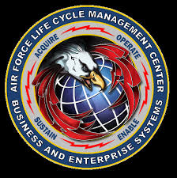

  

AFCEDs is website that the Air Force uses to distribute software across the force.  We were in the process of remaking the site because the old version was extremely buggy and untrustworthy, but unfortunately we ran into budgeting issues midway and the project was canceled.

Source: <a href="https://github.com/Axenix07/AFCEDS"><i class="large github icon "></i>Team BESPIN Website</a>
